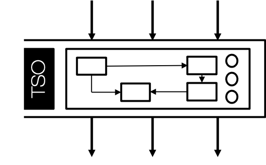
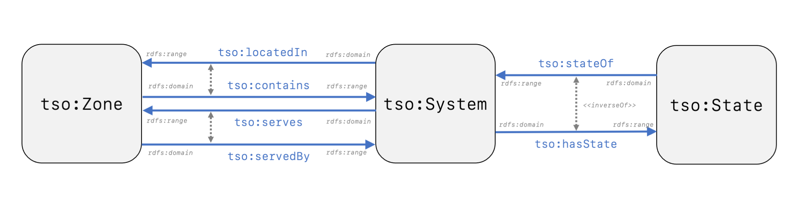
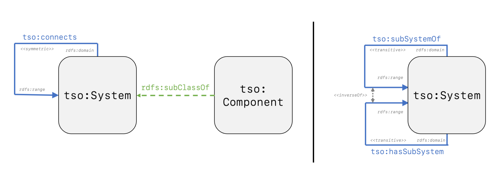
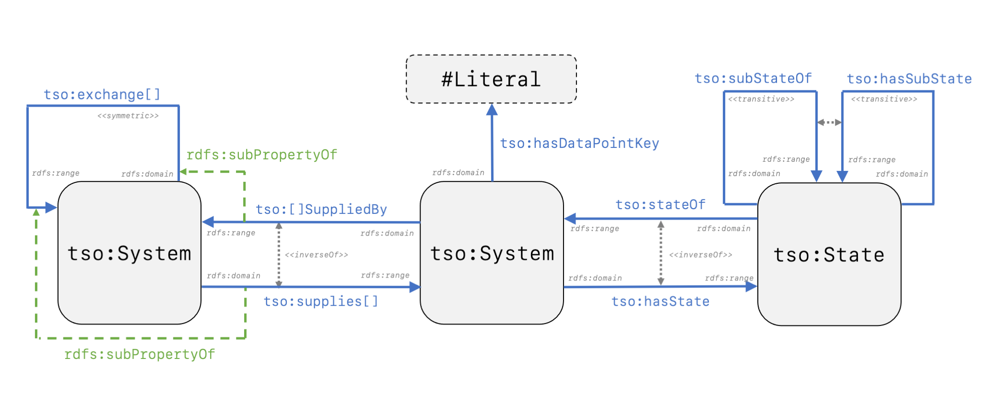

# TUBES System Ontology

 
 

## Uses
The scope of the TUBES System Ontology is to explicitly define the topology of interconnected building service system and their components. As a lightweight ontology it has a strong alignment to other ontologies within the W3C community and aims to provide the means to link information at data level within the AEC industry.

A persistent URI namespace for the TUBES System Ontology (tso) will be provided by [W3ID](https://w3id.org) at <https://w3id.org/tso>.

## Documentation
TSO is provided in <a href="https://raw.githubusercontent.com/RWTH-E3D/tso/master/tubes.ttl" download="tubes.ttl"> Turtle</a>, <a href="https://raw.githubusercontent.com/RWTH-E3D/tso/master/tubes.rdf" download="tubes.rdf"> RDF/XML</a> and <a href="https://raw.githubusercontent.com/RWTH-E3D/tso/master/tubes.json" download="tubes.json">JSON-LD</a> format. Extensive [documentation](https://rwth-e3d.github.io/tso/documentation) for the latest version is also available.

## Concept
The three main classes of the TUBES System Ontology are *tso:System*, *tso:Zone* and *tso:State*.  A *tso:Zone* is defined as a part of the physical world or a virtual world that is inherently both located in this world and has a 3D spatial extent. It has a strong alignment to the zone concept of the Building Topology Ontology. The inverse object properties *tso:serves* and *tso:servedBy* define relationships linking systems and zones to describe that a zone is served by a system, respectively a system serves a zone. *tso:locatedIn* and *tso:contains* define relationships to describe that a system is located in a zone, respectively a zone contains a system. *tso:State* defines the planned internal condition of a component or abstract system. To link a state to a system, respectively a system to a state, the inverse properties *tso:stateOf* and *tso:hasState* are defined. A *tso:System* is a model of a whole which is isolated from the world or a supersystem, which may consists of interconnected components or subsystems and has attributes such as inputs, outputs and states. Within this definition there are three concepts with are further detailed in the following.

  

#### Hierarchical Concept
The hierarchical concept describes a system as a model of a whole which is isolated from the world or a supersystem. To fulfill this concept and describe the hierarchy, *tso:subSystemOf* defines a relationship linking a system to its supersystem. *tso:hasSubSystem* is defined as the inverse of *tso:subSystemOf* and describes a relationship linking a system to its subsystem. Both object properties have their range and domain defined as *tso:System*.

#### Structural Concept
The structural concept describes a system as a model of a whole which may consist of interconnected components and subsystems. To fulfill this concept, systems and components need to be distinguished and their interconnections need to be defined, whereas the hierarchical structure is already defined in the hierarchical concept. A *tso:Component* is defined as a model of a whole which is isolated from the world or a supersystem, which may consists of interconnected components or sub-systems and has attributes such as inputs, outputs and states. The boundary which isolates the component from the world or a supersystem is defined by the manufacturer with regards to the product aspect. Therefore, *tso:Component* is defined as a sub-class of *tso:System*. To further classify different components, concepts from ontologies like IFCOWL need to be implemented. *tso:connects* is a symmetric property defined as a relationship linking systems to describe their topological connection.

  

#### Functional Concept
The functional concept describes a system as a model of a whole which has attributes such as inputs, outputs and states. *tso:State* defines the planned internal condition of a component or abstract system. Multiple states can be defined for one system. This includes specific aspects as on, off, open or closed as well as general aspects such as outdoor-air-operation, mixed-air-operation or heating-operation. Hence, *tso:State* adds another layer of abstraction to describe building service systems which can be operated in more than one manner. To describe the hierarchy of states, the inverse object properties *tso:hasSubState* and *tso:subStateOf* are defined linking a state to its substate or superstate. To describe inputs and outputs of systems, multiple sub-properties of *tso:connects* are defined. On the first level, the three object properties *tso:exchangeData*, *tso:exchangeEnergy* and *tso:exchangeMass* are distinguished. They can be further detailed in which kind of data, energy and mass is exchanged.  To define a directed flow the object properties *tso:supplies...* and *tso:...SuppliedBy* can be used. The data property *tso:hasDataPointKey* defines a relationship which assigns a reference designation to a system.

  

## Examples
Examples of TSO are provided for the [DigitalHub](https://github.com/RWTH-E3D/DigitalHub) and CUBE projects.

- [DigitalHub v0.2]()
- [CUBE v0.2]()

## Contacts

* Nicolas Pauen <pauen@e3d.rwth-aachen.de>
* Dominik Schlütter <schluetter@e3d.rwth-aachen.de>
